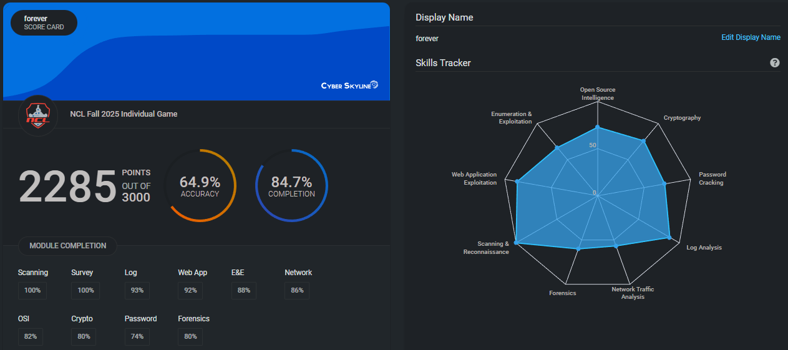
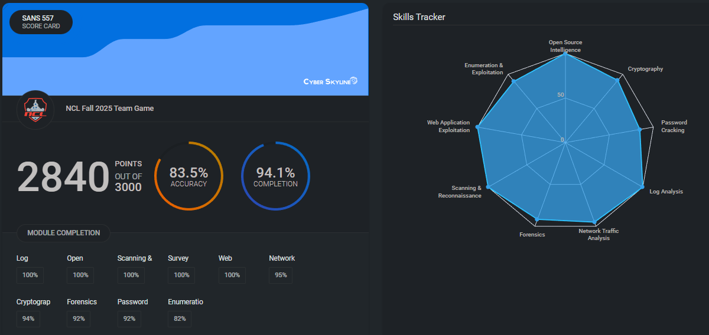

# 🛡️ Cybersecurity Portfolio

## 👋 About Me
Hi, I’m **Nick Silver**, a cybersecurity professional with a deep passion for digital defense, ethical hacking, and applied security engineering. My interest in cybersecurity started over 30 years ago when a friend (in middle school) showed me how he decoded the bar codes from books at our local library. Over the years, I’ve explored everything from **application security** and **threat analysis** to **cloud infrastructure hardening**, building both technical depth and strategic insight into how organizations defend their systems.

What began as curiosity about how systems break has evolved into a commitment to helping secure them.

---

## 🎯 Capture The Flag (CTF) Experience
Participating in CTF competitions like the **National Cyber League (NCL)** has been one of the most rewarding aspects of my cybersecurity journey.  
CTFs challenge me to think critically, stay curious, and apply skills across multiple domains such as:

- Cryptography  
- Network traffic analysis  
- Web exploitation  
- Log analysis  
- Open-source intelligence (OSINT)

Each challenge pushes me to approach problems creatively under time pressure — an experience that mirrors real-world incident response and red-team scenarios.

---

## 🏅 NCL Fall 2025 Scores and Scouting Report

Here’s a snapshot of my latest Scouting Report performance:

Individual Rank: 302 / 7869
Team Rank: **29** / 4214

---

## 🧭 Reflection
CTFs have strengthened not only my technical skills but also my persistence and teamwork. They’ve taught me how to **break down complex problems**, **collaborate effectively**, and **maintain composure under pressure**. The process of researching, testing, and validating hypotheses has directly enhanced my analytical skills as a security engineer.

Through NCL, I’ve gained greater confidence in identifying and exploiting vulnerabilities, conducting forensic investigations, and translating findings into actionable mitigations — all while maintaining ethical boundaries and respect for responsible disclosure.

---

## 🌟 Highlights
Here are a few takeaways and milestones from my CTF experience:

- **Ranked among top performers** in several NCL categories
- Developed custom scripts to automate portions of challenges
- Earned high scores on the **Scouting Report**, reflecting strong aptitude across multiple cybersecurity domains  
- Improved proficiency in tools like **Wireshark**, **Burp Suite**, **hashcat**, and **Autopsy** through hands-on practice  
- Strengthened collaboration skills by sharing strategies and approaches within my team (while adhering to NCL’s confidentiality policy)

---

## 🔍 Looking Ahead
I continue to expand my expertise through ongoing participation in CTFs, professional certifications, and real-world projects.  
My current focus areas include **cloud security (AWS)**, **identity & access management**, and **security automation** — bridging the gap between offensive insight and defensive architecture.

---

## 📫 Connect
If you’d like to connect, collaborate, or discuss security research ideas, feel free to reach out!  

- **LinkedIn:** [linkedin.com/in/nickksilver](https://linkedin.com/in/nickksilver)  
- **GitHub:** [github.com/nsilver7](https://github.com/nsilver7)
